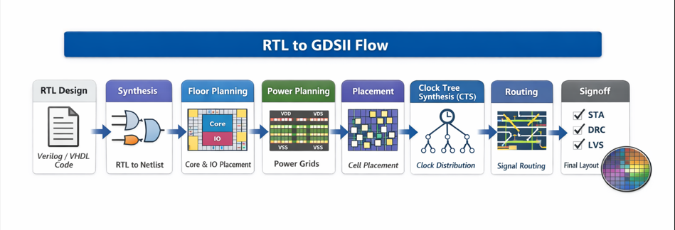
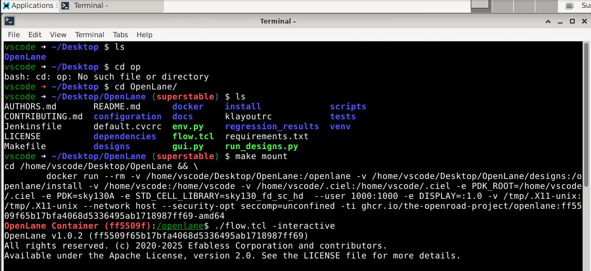
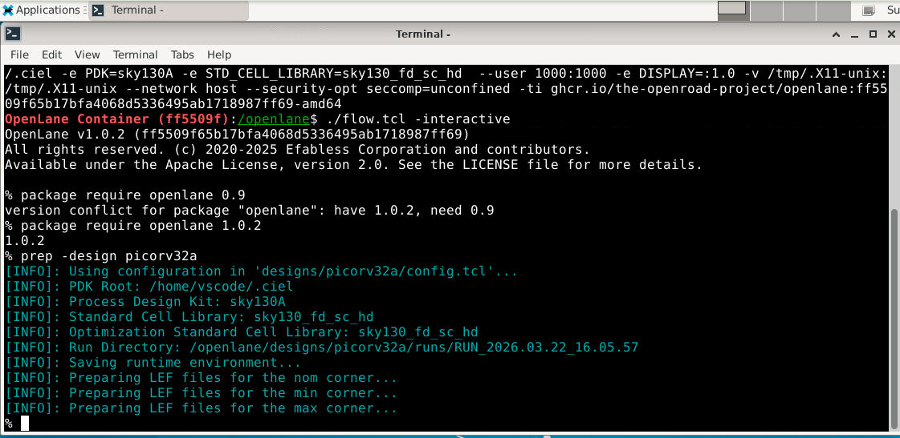
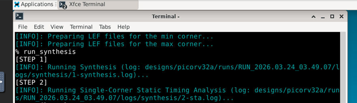
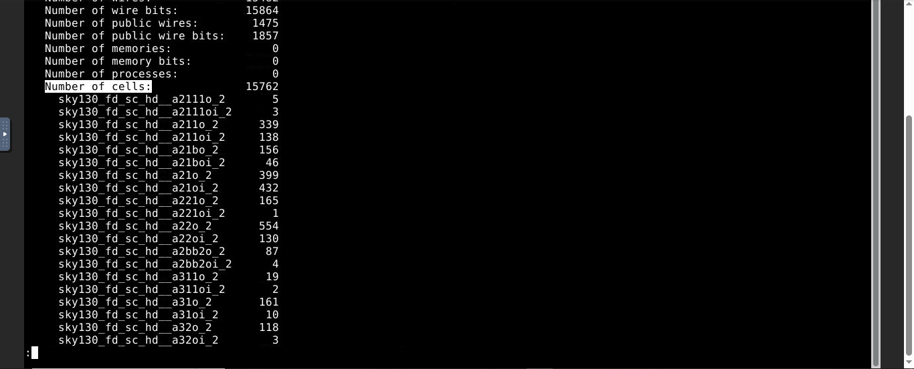
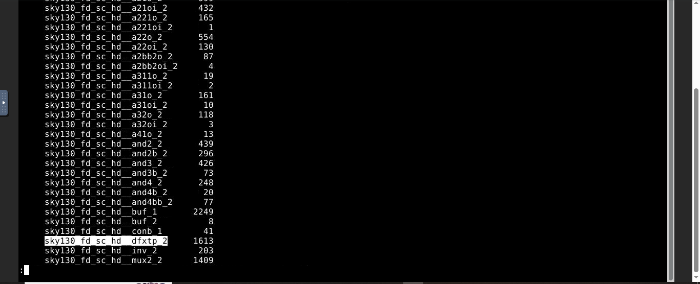

# SOC-Design-and-Planning

<p>Welcome :)
  
  In this repository, I have documented my learnings through this 10-day workshop organised by VSD (VLSI System Design) in collaboration with NASSCOM. This workshop entails the complete RTL-to-GDSII flow of picorv32a.This workshop has been executed on cloud platform.


<b> Day 1: Inception of open-source EDA, OpenLANE and Sky130 PDK </b>

  - Introduction to OpenLANE and Sky130
  
  - Understanding library cells and flop ratio
  
  - RTL synthesis and timing report analysis

<details>
<summary>Click to expand detailed notes</summary>

---
<b>Understanding RTL-to-GDSII flow:</b>



<b>1. RTL Design (Front-End) </b>
   * Written in Verilog / VHDL
   * Describes functionality (not physical structure)

<b>2. Synthesis </b>
   * Tool converts RTL → gate-level netlist
   * Uses standard cell libraries (.lib)
   * Logic optimization
   * Technology mapping
   * Timing optimization
     
<b>3. Floorplanning </b>
   * Define chip layout structure
   * Die size & core area
   * Macro placement (SRAM, IPs)
   * IO pad placement

<b>4. Power Planning </b>
   * Design power distribution network (PDN)
  
<b>5. Placement </b>
   * Place standard cells in rows
   * Steps:
     -Global placement
     -Detailed placement
     -Optimization for timing & congestion
<b>6. Clock Tree Synthesis (CTS) </b>
   * Build clock distribution network
     Goals:
     -Minimize skew
     -Control latency
     -Reduce clock uncertainty

<b>7. Routing </b>
   * Connect all placed cells
     Types:
     -Global routing (rough paths)
     -Detailed routing (exact metal layers)

<b>8. Signoff Checks </b>
  *  STA (Static Timing Analysis)
     Checks setup & hold violations
  * DRC (Design Rule Check)
     Ensures layout follows foundry rules
  * LVS (Layout vs Schematic)
      Matches layout with netlist
  * IR Drop & EM Analysis
      Checks power integrity

<b>9.  GDSII Generation </b>
  * Final layout file sent to fabrication

---

 <h3>Open source EDA tools:</h3>
 <h3>OpenLane:</h3>
 OpenLane is an open-source RTL-to-GDSII flow used for digital ASIC design. It automates the entire Physical Design process using open-    source tools.

OpenLane is not a single tool — it’s a flow integrating multiple tools:
| Tool | Stage |
|-----|------|
| Yosys,ABC           | → Synthesis          |
| OpenROAD            | → Placement          |
| TritonCTS           | → CTS                | 
| TritonRoute,FastRout| → Routing            |
| Magic,Netgen        | → DRC, layout viewing|
| Netgen              | → LVS checks         | 
| KLayout,Magic       | → GDS visualization  |
| OpenRCX             | → SPEF Extraction    |
| OpenSTA             | → Timing Analysis    |

___

<b> Lab Activities </b>

Invoke the OpenLane tool by navigating to >>Desktop>>OpenLane

```
>cd /home/vscode/Desktop/OpenLane
>make mount
>./flow.tcl -interactive
>package require openlane 1.0.2
```

  
```
prep -design picorv32a
```
This command is used as the design setup to set the environment variables,informing the tool about the pdk,standard cell libraries,and also creating the runs directory.



After we prep the design we are ready to synthesize the design and we use the command run_synthesis.
```
run_synthesis
```



Computing the flop ratio after synthesis:



```
Flop ratio= (Number of D-ffs)/(Total cell count)
          = 1613/15762
          = 0.10233 (10.23% of the total cell count are d-flip flops)
```
</details>

<b> Day 2: Floorplanning and Physical Preparation </b>


- Introduction to OpenLANE and Sky130  

- Understanding library cells and flop ratio
  
- RTL synthesis and timing report analysis  

<details>
<summary>Click to expand detailed notes</summary>

(Add screenshots, commands, observations here)

</details>
